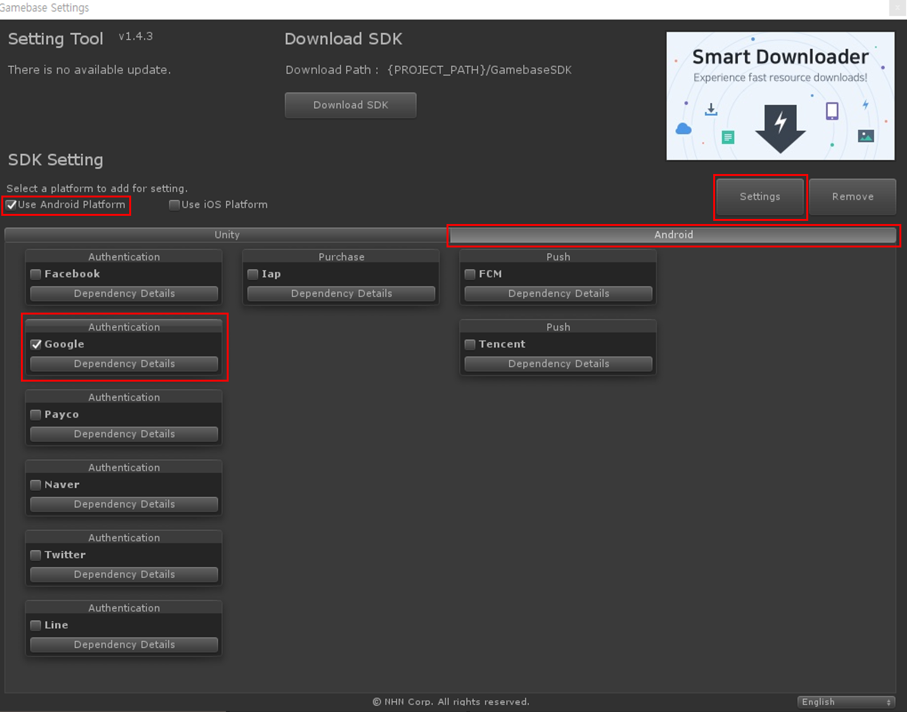

###################
Gamebase SDK 설치
###################

Setting Tool을 통해서 Gamebase SDK를 설치합니다.

플랫폼 선택
=============

Android만 선택합니다.

모듈 선택
============

Android 탭 > Google 모듈을 선택 합니다.

설치
===========

플랫폼과 모듈을 선택했으면 Gamebase SDK를 설치합니다.

* **Settings** 클릭

