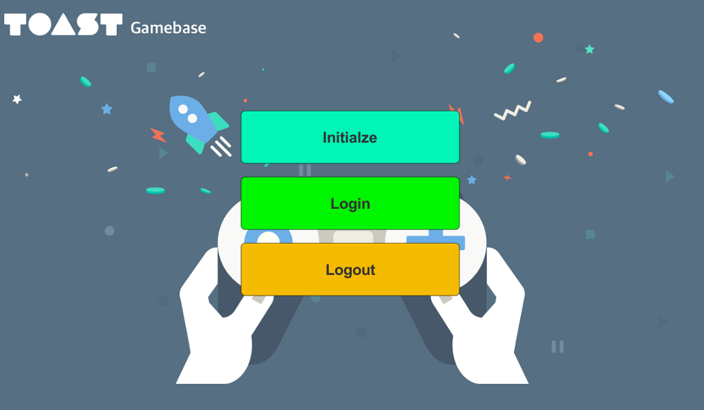

#######################
Gamebase Google Login
#######################

Google Login 구현
===============================

* Assets/TOAST/Codelab/Gamebase/Scripts/HandsOnLab/UserImplementation.cs 파일의 Login() 함수를 다음과 같이 수정

.. code-block:: C#

    public void Login()
    {
        Gamebase.Login(GamebaseAuthProvider.GOOGLE, (authToken, error) =>
        {
            if (Gamebase.IsSuccess(error) == true)
            {
                SampleLogger.Log(string.Format("Guest login succeeded. User id is {0}", authToken.member.userId));
            }
            else
            {
                SampleLogger.Log(string.Format("Guest login failed. Error is {0}", error.ToString()));
            }
        });
    }

Build & Run
===============================

Menu > File > Save Project

1. Android 디바이스 연결
2. **Menu > File > Build & Run**
3. APK 파일 이름 지정 팝업이 뜰 경우 **gamebase-handsonlab.apk** 로 설정
4. 디바이스에서 실행 확인
5. **Initialize** 버튼 클릭 후 Initialize 성공 확인
6. **Login** 버튼 클릭 후 로그인 성공 확인

Troubleshooting
===============================

Login 중 오류가 발생할 경우 다음 문서를 참고하시기 바랍니다.

`Error Handling <http://docs.toast.com/ko/Game/Gamebase/ko/unity-authentication/#error-handling>`_ 